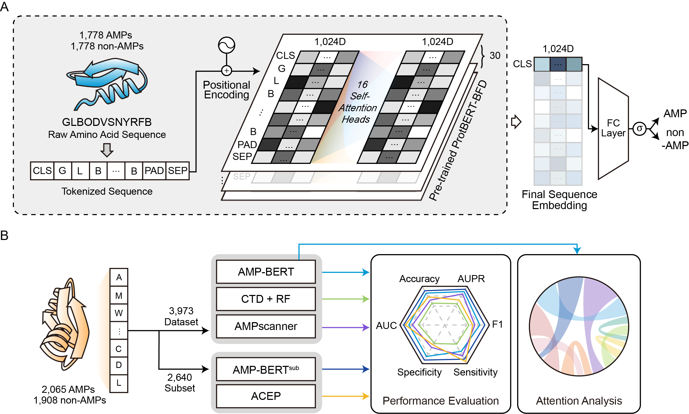

# AMP-BERT: Prediction of Antimicrobial Peptide Function Based on a BERT Model

AMP-BERT is a deep-learning classifier that labels a peptide sequence as **AMP** (antimicrobial) or **non-AMP**. It fine-tunes the protein language model **[ProtBERT-BFD](https://huggingface.co/Rostlab/prot_bert_bfd)** ([Elnaggar et al., 2021](https://doi.org/10.1109/TPAMI.2021.3095381)) on curated AMP datasets.

This repository is organised around three things you can reproduce end-to-end, all runnable on **Google Colab**:

1. [Part 1 · About AMP-BERT](#part-1--about-amp-bert)
2. [Part 2 · Reproduce the original paper (train + test)](#part-2--reproduce-the-original-paper-train--test)
3. [Part 3 · ESCAPE benchmark (train + test)](#part-3--escape-benchmark-train--test)

---

## Part 1 · About AMP-BERT

### Abstract
Antimicrobial resistance is a growing health concern. Antimicrobial peptides (AMPs) disrupt harmful microorganisms by non-specific mechanisms, making it difficult for microbes to develop resistance. Accordingly, they are promising alternatives to traditional antimicrobial drugs. In this study, we developed an improved AMP classification model, called AMP-BERT. We propose a deep learning model with a fine-tuned BERT architecture designed to extract structural/functional information from input peptides and identify each input as AMP or non-AMP. We compared the performance of our proposed model and other machine learning-based and deep learning-based methods. Our model, AMP-BERT, yielded the best prediction results among all models evaluated with our curated external dataset. In addition, we utilized the attention mechanism in BERT to implement an interpretable feature analysis and determine the specific residues in known AMPs that contribute to peptide structure and antimicrobial function. The results show that AMP-BERT can capture the structural properties of peptides for model learning, enabling the prediction of AMPs or non-AMPs from input sequences. AMP-BERT is expected to contribute to the identification of candidate AMPs for functional validation and drug development.

### Model overview


### Repository layout
```
AMP-BERT/
├── src/amp_bert/          # reusable package (notebooks stay thin)
│   ├── config.py          # repo-relative paths (no hard-coded /home/...)
│   ├── data.py            # AmpDataset + load_dataset
│   ├── metrics.py         # accuracy / F1 / precision / recall / MCC / AUC
│   └── model.py           # model_init + build_training_args
├── notebooks/
│   ├── 01_reproduce_amp_bert.ipynb  # Part 2 — train + test (one notebook)
│   ├── 02_escape_benchmark.ipynb    # Part 3 — train + test (one notebook)
│   └── _legacy_fine-tune_with_amps.ipynb  # original notebook, kept for reference
├── data/raw/              # datasets (see data/README.md)
├── config/default.yaml    # experiment hyper-parameters
├── models/  results/      # checkpoints & outputs (git-ignored)
└── requirements.txt  pyproject.toml
```

### Setup
**Colab (recommended):** the notebooks are **self-contained** — open one via its
Colab badge below and run top to bottom. The first cell installs a pinned
`transformers`, the logic is inlined step by step, parameters sit next to the
step that uses them, and datasets are read straight from this repo's raw URLs.
Each notebook covers **both train and test**, saving/loading the model via Google
Drive so you can retrain once and re-test in any later session. No cloning, no
`git pull`, no restart cycle.

**Local / scripting:** the same logic is packaged under `src/amp_bert/` for `import`
and reuse:
```bash
pip install -r requirements.txt
pip install -e .          # makes `import amp_bert` available
```

### Datasets
| file | role | label |
|------|------|-------|
| `data/raw/all_veltri.csv` | training set (Veltri) | mixed |
| `data/raw/veltri_dramp_cdhit_90.csv` | external test — AMPs (DRAMP) | AMP |
| `data/raw/non_amp_ampep_cdhit90.csv` | external test — non-AMPs (AMPEP) | non-AMP |

All CSVs share the schema `aa_seq, aa_len, AMP`. See [data/README.md](data/README.md) for details.

---

## Part 2 · Reproduce the original paper (train + test)

Reproduce AMP-BERT exactly as published: fine-tune on the Veltri training set, then evaluate on the external test set (DRAMP AMPs ∪ AMPEP non-AMPs). Part A trains and saves AMP-BERT to Drive; Part B loads it and evaluates.

| notebook | Colab |
|----------|-------|
| [`notebooks/01_reproduce_amp_bert.ipynb`](notebooks/01_reproduce_amp_bert.ipynb) | [](https://colab.research.google.com/github/BioGavin/AMP-BERT/blob/main/notebooks/01_reproduce_amp_bert.ipynb) |

Reports accuracy, F1, precision, recall, MCC and ROC-AUC on the merged external test set, writing per-sequence predictions to `results/external_test_predictions.csv`.

---

## Part 3 · ESCAPE benchmark (train + test)

Reproduce **AMP-BERT on the [ESCAPE benchmark](https://github.com/BCV-Uniandes/ESCAPE)** (Ojeda et al., NeurIPS 2025) — a **multilabel** task with 5 binary labels (Antibacterial, Antifungal, Antiviral, Antiparasitic, Antimicrobial). The notebook adapts AMP-BERT with a 5-way multilabel head (`BCEWithLogitsLoss`), auto-downloads the dataset from Harvard Dataverse, trains on Fold1 + Fold2 (seed 0, single model — no multi-seed/ensemble), and evaluates on the Test split. Metrics replicate ESCAPE's official `compute_metrics`: per-class AP → **mAP**, and per-class best-threshold F1 → overall **F1** (paper reports AMP-BERT: F1 64.7 / mAP 66.9).

| notebook | Colab |
|----------|-------|
| [`notebooks/02_escape_benchmark.ipynb`](notebooks/02_escape_benchmark.ipynb) | [](https://colab.research.google.com/github/BioGavin/AMP-BERT/blob/main/notebooks/02_escape_benchmark.ipynb) |

**Setup:** place the ESCAPE splits (`escape_train.csv`, `escape_test.csv`, schema `aa_seq, aa_len, AMP`) under `data/raw/escape/`, then run `03` → `04`. `03` saves the model to `models/amp_bert_escape/`; `04` evaluates it and writes
`results/escape_test_predictions.csv`.

